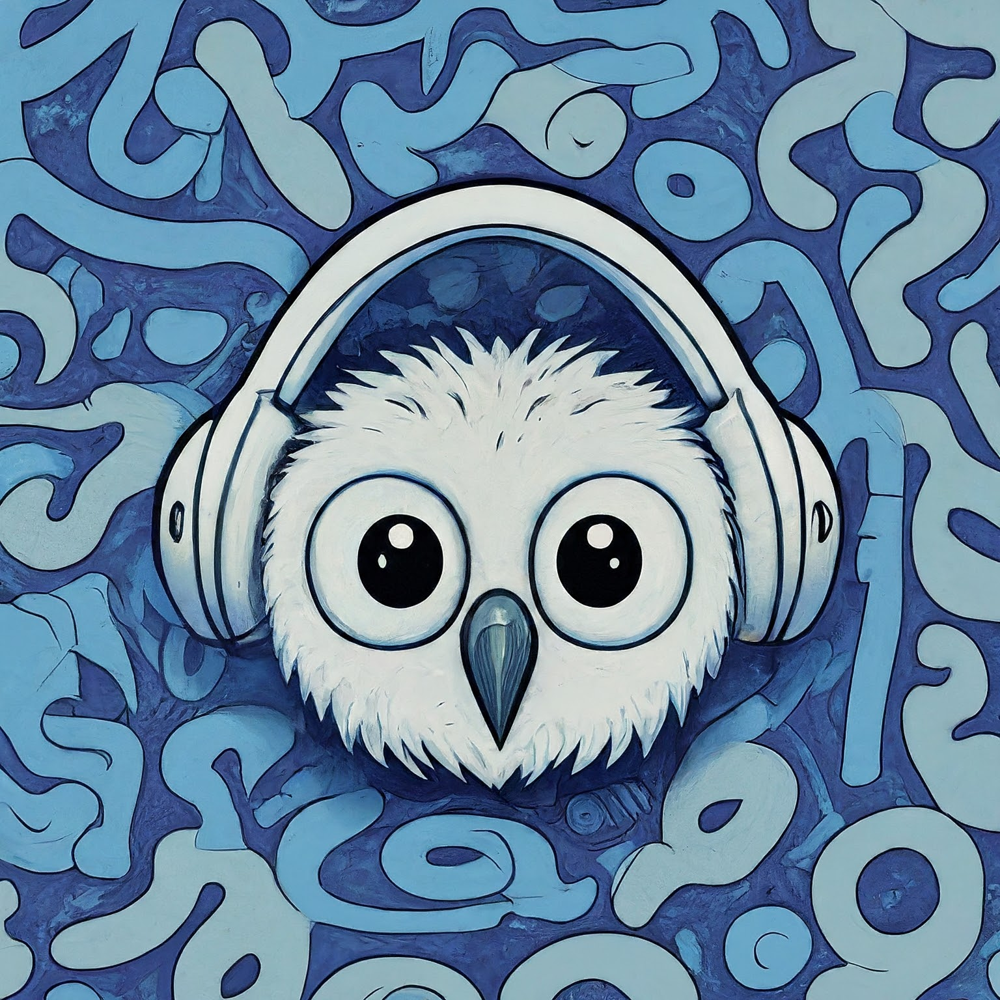

<br/>
<p align="center">
  <a href="https://github.com/Owlvernyte/Hoot">
    
  </a>

  <h3 align="center">Hoot</h3>

  <p align="center">
    A Functional Discord Music Bot
    <br/>
    <br/>
    <a href="https://github.com/Owlvernyte/Hoot/issues">Report Bug</a>
    .
    <a href="https://discord.gg/F7ZK6ssMUm">Request Feature</a>
  </p>
</p>


<div style="text-align: center;">

    [](https://github.com/Owlvernyte/Hoot/actions/workflows/deploy.yml)

</div>

## Built With

* [Node.js](https://nodejs.org/)
* [Discord.js](https://discord.js.org/)
* [DisTube.js](https://distube.js.org/)

## Getting Started

### Installation

[Discord Provided Link](https://discord.com/oauth2/authorize?client_id=804616628359921684)

## Usage

It doesn't use normal prefix, use Slash Command instead. `/play [song name]` to start queueing your favorite song!

> There is no official document to use this bot instead of using a slash command to show a full list of commands: `/help`

## Self Host

A `config.json` file will be required (rename `config.example.json`):
```json
{
	"bot_name": "the Bot name",
    "modules": {
        "use_server": "no",
        "use_backup": "no",
        "use_status_changer": "no"
    },
    "prefix": "-",
    "support_server_id": "Your Support Server ID",
	"token": "Your Discord Bot Token",
	"owner": "Your Discord ID",
	"client_id": "Your Discord Application Client ID",
	"test_guild_id": "Your Testing Discord Server",
	"backup_channel_id": "",
	"backup_url": "",
	"testers": [
		"tester ID 1",
		"tester ID 2"
	],
	"use_database": "sqlite",
	"database": {
		"name": "database_name",
		"mysql": {
			"host": "database host",
			"user": "database user",
			"pass": "database pass",
			"port": 3306
		},
		"sqlite": {
			"file": "json.sqlite"
		}
	},
	"topggToken": "",
	"dev": "on",
	"port": 3000
}
```

Run the bot with [PM2](https://pm2.keymetrics.io): `pm2 start ecosystem.config.js`

## Contributing

Contributions are what make the open source community such an amazing place to be learn, inspire, and create. Any contributions you make are **greatly appreciated**.

* If you have suggestions for adding or removing projects, feel free to [open an issue](https://github.com/Owlvernyte/Hoot/issues/new) to discuss it, or directly create a pull request after you edit the _README.md_ file with necessary changes.
* Please make sure you check your spelling and grammar.
* Create individual PR for each suggestion.
* Please also read through the [Code Of Conduct](https://github.com/Owlvernyte/Hoot/blob/master/CODE_OF_CONDUCT.md) before posting your first idea as well.

### Creating A Pull Request

1. Fork the Project
2. Create your Feature Branch (`git checkout -b feature/AmazingFeature`)
3. Commit your Changes (`git commit -m 'Add some AmazingFeature'`)
4. Push to the Branch (`git push origin feature/AmazingFeature`)
5. Open a Pull Request

## License

Distributed under the MIT License. See [LICENSE](https://github.com/Owlvernyte/Hoot/blob/master/LICENSE.md) for more information.

## Authors

* **Fiezt** - _HUTECH Student_ - [Fiezt](https://github.com/Owlvernyte/) - _Bot Dev_

## Acknowledgements

* [Terms of Service](https://github.com/Owlvernyte/Hoot/blob/master/TERMS_OF_SERVICE.md)
* [Privacy Policy](https://github.com/Owlvernyte/Hoot/blob/master/PRIVACY_POLICY.md)
* [NamVr Discord Bot Template](https://github.com/NamVr/DiscordBot-Template)
